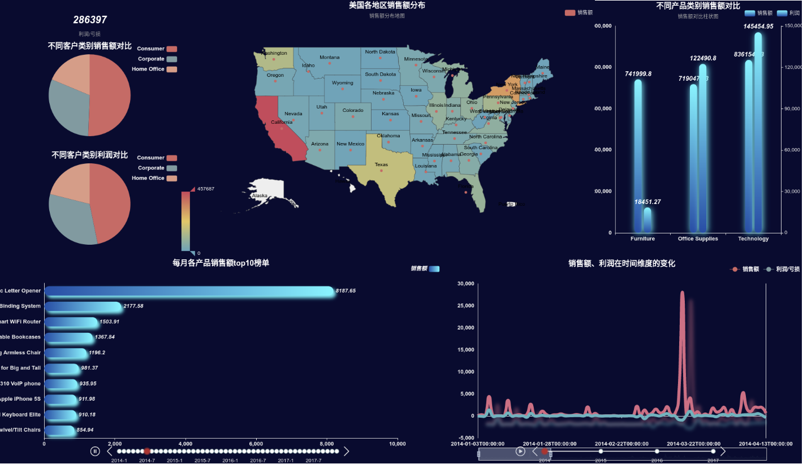

# 本项目旨在利用pyecharts生成boss大屏测试
1. 环境
> python 3.6.13  
> 需要的python第三方包, 详见requirements.txt

2. 实现过程  
2.1 利用python生成初始页面`0_超市数据可视化大屏.html`  
2.2 浏览器打开`0_超市数据可视化大屏.html`，生动调整页面布局，并保存布局文件`chart_config.json`  
2.3 利用`chart_config.json`和`0_超市数据可视化大屏.html`重新生成最终的boss大屏页面文件`2_超市数据可视化大屏.html`

3. 实现方案优点  
   (1) 本项目中对所引用的js和css的外链资源直接附加在html页面中，保证在离线的内网环境中也可以正常看到最终的页面效果；  
   (2) 本项目完全是利用python进行大屏可视化工作，不需要借助其他工具；

4. 实验效果
